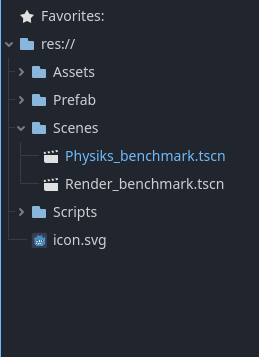
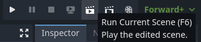
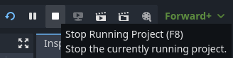

# Godot Physics & Render Benchmark

Dieses Projekt ist ein **Physik- und Render-Benchmark**, das mit **Godot Engine 4.3** entwickelt wurde. Es misst die Leistungsfähigkeit eines Systems, indem es Szenarien wie das Befüllen eines Beckens mit Kugeln und die Simulation eines wachsenden Gitters ausführt. Die Messwerte helfen, die maximale Kapazität der Engine und der Hardware zu ermitteln.

## Anforderungen

<ul>
  <li><strong>Godot Engine 4.3 oder neuer:</strong> Stelle sicher, dass du die richtige Version installiert hast. Die Funktionalität des Benchmarks hängt von den neuesten Funktionen und Optimierungen der Engine ab.</li>
  <li>Ein <strong>System mit GPU-Unterstützung</strong> für das Render-Benchmarking.</li>
</ul>

## Funktionen des Projekts

<ol>
  <li>
    <strong>Becken-Füllung:</strong>
    <ul>
      <li>Ein Becken mit den Abmessungen <strong>20x20 m</strong> wird mit Kugeln (Durchmesser 0,5 m) befüllt.</li>
      <li>Es wird gemessen, wie viele Kugeln hinzugefügt werden können,bis die Anwendung geschlossen wird.</li>
    </ul>
  </li>
  <li>
    <strong>Wachsendes Gitter:</strong>
    <ul>
      <li>Ein Gitter aus Blöcken wächst schichtweise. Mit jeder Schicht wird das Gitter größer, und die Kamera passt ihre Position dynamisch an.</li>
      <li>Die Performance wird in Bezug auf die durchschnittliche Frame-Time und die Anzahl der Blöcke gemessen.</li>
    </ul>
  </li>
  <li>
    <strong>Leistungsüberwachung in Echtzeit:</strong>
    <ul>
      <li>Das Projekt nutzt die <code>Performance</code>-API von Godot, um wichtige Daten wie FPS und Objektanzahl zu erfassen und anzuzeigen.</li>
    </ul>
  </li>
</ol>

## Installation

<ol>
  <li>Godot downloaden (https://godotengine.org)</li>
  <li>Lade das Repository herunter oder klone es.</li>
  <li>Öffne das Projekt mit Godot 4.3.</li>
</ol>

## Nutzung

### Bechmarks starten
<ol>
  <li>Öffne den Ordner "Scenes" und wähle einen der beiden Benchmarks aus.</li>
  
  <li>Um den Benchmark zu starten, betätige den "Run current scene" Knopf.</li>
  
  <li>Um den Benchmark danach wieder zu schließen, betätige den "Stop running Project" Knopf.</li>
  
</ol>

### Physik-Benchmark (Becken-Füllung)

<ol>
  <li>Beim Start wird das Becken automatisch mit Kugeln gefüllt (eine Kugel pro Millisekunde).</li>
  <li>Der Benchmark endet wenn man die Anwendung schließt.</li>
  <li><strong>Ergebnisse:</strong>
    <ul>
      <li>Die Anzahl der Kugeln und die gemessene maximale Frame-Time werden in der Konsole protokolliert.</li>
    </ul>
  </li>
</ol>

### Render-Benchmark (Wachsendes Gitter)

<ol>
  <li>Die Szene erzeugt ein Gitter, das sich mit jeder Kamerarotation vergrößert.</li>
  <li>Während des Tests werden die folgenden Daten angezeigt:
    <ul>
      <li>FPS</li>
      <li>Anzahl der Objekte</li>
      <li>Anzahl der gerenderten Objekte</li>
    </ul>
  </li>
  <li><strong>Ergebnisse:</strong> Ergebnisse werden in der Konsole ausgegeben.</li>
</ol>

## Messwerte verstehen

<ul>
  <li><strong>FPS (Frames per Second):</strong> Gibt an, wie flüssig die Simulation läuft. Werte unter <strong>10 FPS</strong> deuten auf Leistungsengpässe hin.</li>
  <li><strong>Object Count:</strong> Zeigt, wie viele aktive Nodes (Kugeln, Blöcke) in der Szene existieren.</li>
  <li><strong>Active 3D Physics Objects:</strong> Zeigt, wie viele aktive Objecte mir Riggidbody (Kugeln) in der Szene existieren.</li>
  <li><strong>Total Objects in Frame:</strong> Zeigt, wie viele aktive Nodes (Kugeln, Blöcke) in der Szene gerendert werden</li>
</ul>

---

Mit diesem Benchmark kannst du die Grenzen deiner Hardware und die Performance von Godot unter intensiver Nutzung testen!
